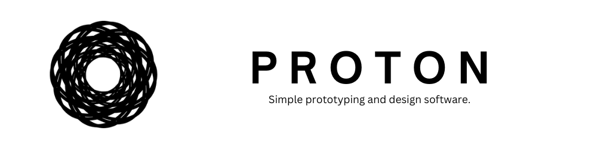

# Proton Designer
App designer, builder and prototyper.

> CAUTION: THIS IS PRE-RELEASE SOFTWARE. I DO NOT GUARANTEE THAT THIS WILL WORK UNDER ALL CIRCUMSTANCES. USE AT YOUR OWN RISK.

Releases can be found in the Releases tab.

---

## Running

1. Clone the repo and change directory to it:
```
git clone https://github.com/ProtonDesigner/core
cd core
```
2. Install the dependencies
```
$ yarn
```
3. Run the application
```
$ yarn dev
```
## Debugging (only in VSCode)

1. Make sure you have the repo open in VSCode (step 1 above)
2. Go to the "Run and Debug" tab on the sidebar
3. Run "Debug Main and Renderer Processes"

## Building

1. Make sure you have cloned the repo (step 1 above)
2. Run this command. It should put the executable in the `dist/` folder
```
$ yarn build
```

---

For support, showcasing, and ideas, join the Discord server: https://discord.gg/xvACqqYDer

---

More to come 👀


